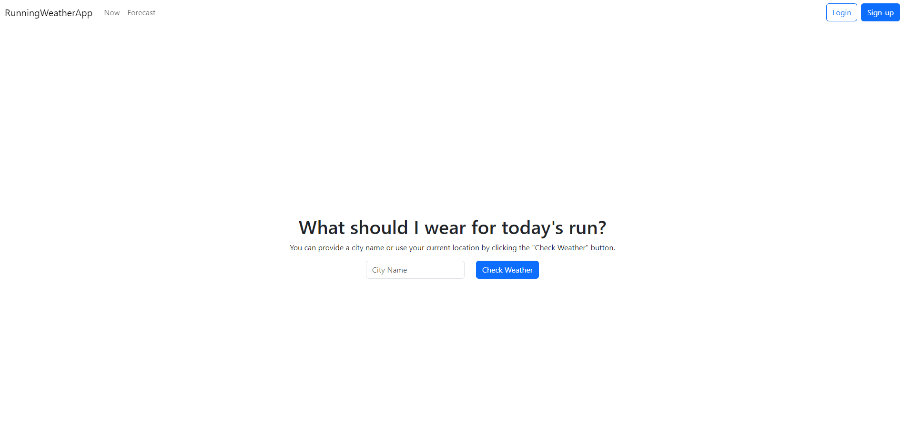
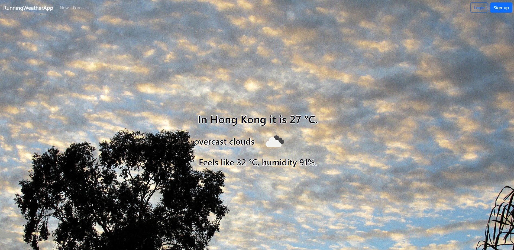
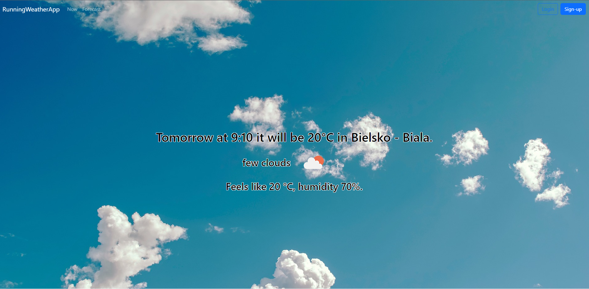

# Running Weather App
WebApp based on openweathermap API - Work in Progress
## First Page

## Forecast Page

## Date picker

## Time picker

# Example of use
## Current weather in Hong Kong

## Current weather in your location

## Forecast in Warsaw

## Forecast in your location

## Forecast tomorrow

### Used background photos from https://pixabay.com

